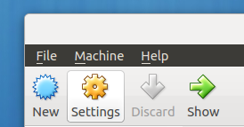
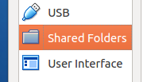
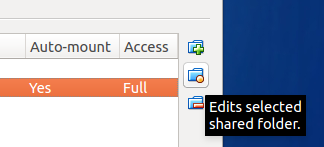
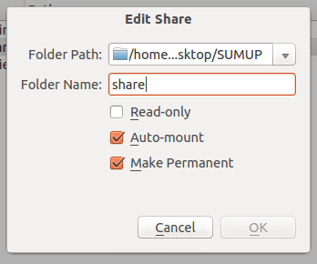
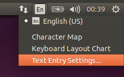

Setup:
======

Open Virtual Box (if you don't have it download it [here](https://www.virtualbox.org/wiki/Downloads)). 
Create a new virtual machine using the provided vdi image.

Open the VM Settings and go to Shared Folders.

Click on the button to edit the existing shared folder.

 
Browse for the folder you want to work on. Make sure Name the shared folder "share", and automount is on.

Once you start the virtual machine the files should be available in the `share` folder on the desktop.

Running:
========

The password for the virtual machine is `sumup`

On the desktop you will find a folder named `share`, if the setup worked the folder should contain your files.

Open a terminal using `ctrl+alt+T`.

Run the command: `dump_json.py ~/Desktop/share/`

(Replace `~/Desktop/share/` with another folder if needed)

If everything worked correctly this should create a file named `output.json` in your current directory (usually the home directory). This file can then be passed to Anser Indicus for analysis.

Common issues:
==============

Automount
---------

If the shared folder doesn't mount automatically open a terminal (`Ctrl+alt+T`) and run:

`sudo mount -t vboxsf -o rw,uid=1000,gid=1000 share ~/Desktop/share`

(Replace `~/Desktop/share/` with another folder if needed)

Keyboard layout
---------------

If you are not able to enter certain characters you may need to change the keyboard layout on the top right corner

For any other problem, contact alessandro.preziosi@sumupanalytics.com
